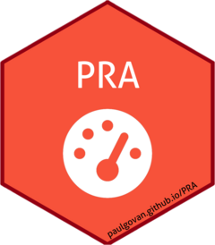
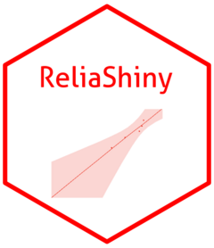
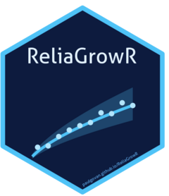
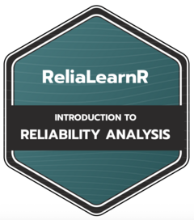
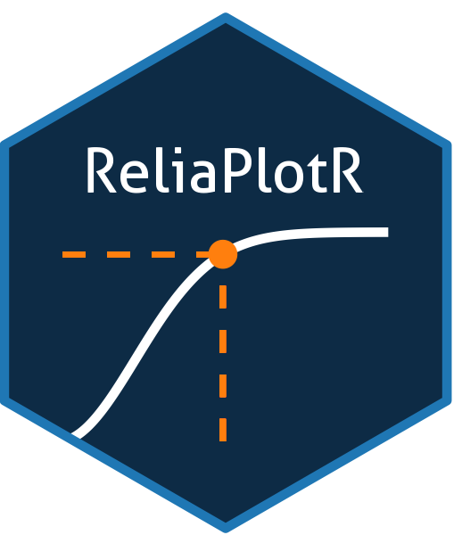
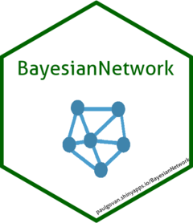
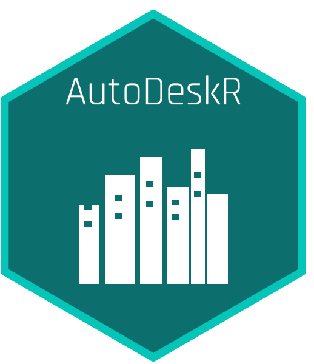

# Hi, I'm Paul Govan

I'm an aerospace engineer who enjoys building useful tools and contributing to open source projects. I enjoy working with R and Python, and I'm happy to collaborate and learn.

## About Me

- Currently working on [PRA](https://github.com/paulgovan/PRA)
- Open to collaborating on [ReliaShiny](https://github.com/paulgovan/ReliaShiny)
- Author of several R packages for reliability engineering (see Projects below)
- Ask me about any of my projects!

## Projects

| | Project | Description |
|---|---|---|
|  | [PRA](https://github.com/paulgovan/PRA) | Project Risk Analysis |
|  | [ReliaShiny](https://github.com/paulgovan/ReliaShiny) | A Shiny App for Reliability Analysis |
|  | [ReliaGrowR](https://github.com/paulgovan/ReliaGrowR) | Reliability Growth Analysis |
|  | [ReliaLearnR](https://github.com/paulgovan/ReliaLearnR) | Learning Modules for Reliability Analysis |
|  | [ReliaPlotR](https://github.com/paulgovan/ReliaPlotR) | Interactive Reliability Probability Plots |
|  | [BayesianNetwork](https://github.com/paulgovan/BayesianNetwork) | Bayesian Network Modeling and Analysis |
|  | [eAnalytics](https://github.com/paulgovan/eAnalytics) | Dynamic Web-based Analytics for the Energy Industry |
|  | [AutoDeskR](https://github.com/paulgovan/AutoDeskR) | An R Interface to the AutoDesk Platform |

## Skills

## GitHub Stats

## Get in Touch

