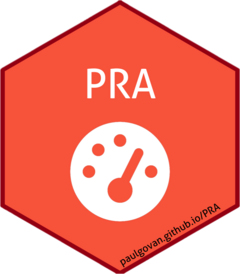
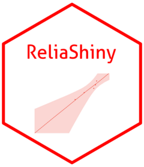
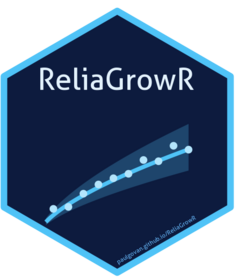
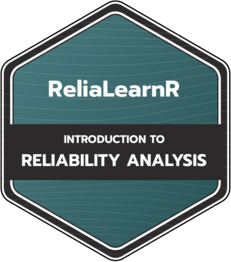
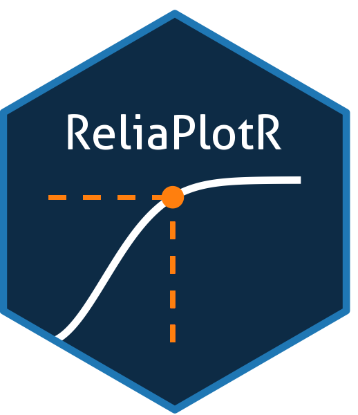
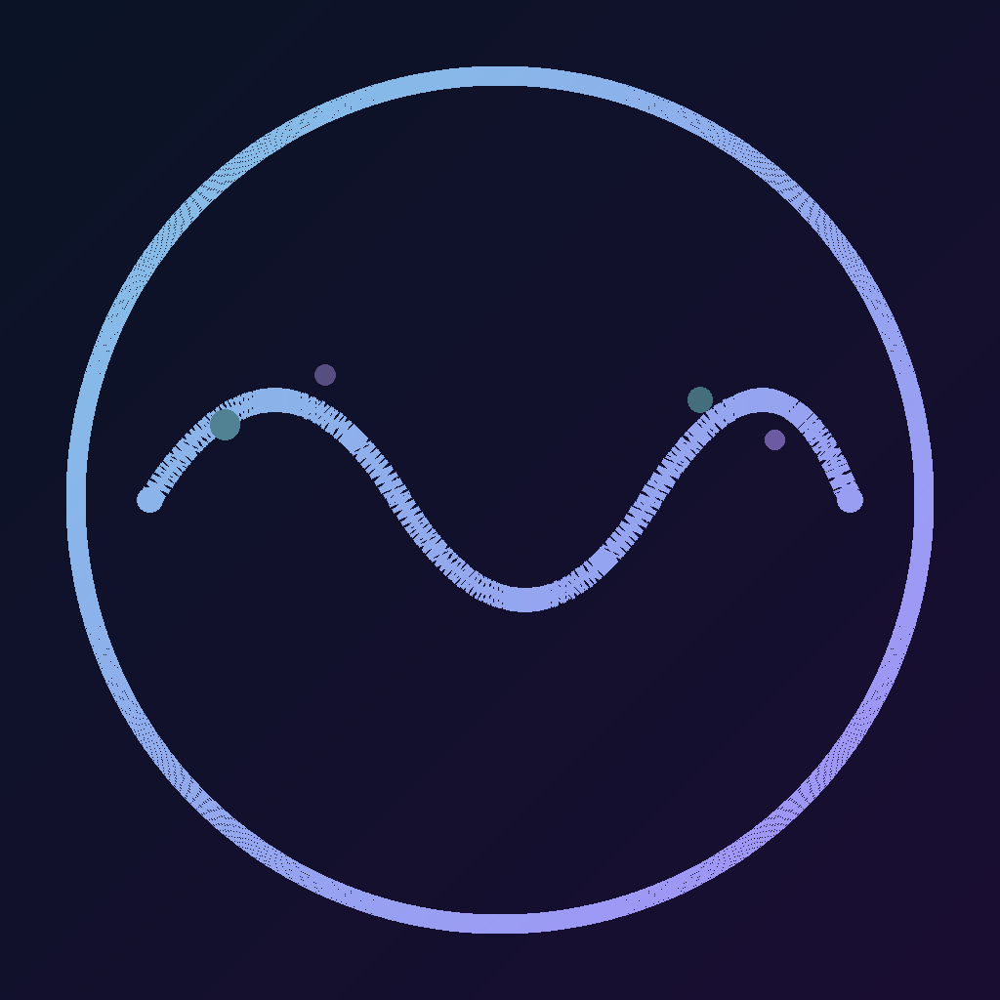
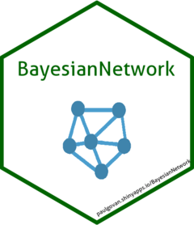
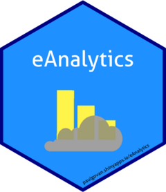
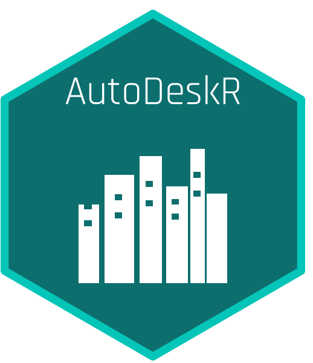

# Hi, I'm Paul Govan

I'm an aerospace engineer who enjoys building useful tools and contributing to open source projects. I enjoy working with R and Python, and I'm happy to collaborate and learn.

## About Me

- Currently working on [PRA](https://github.com/paulgovan/PRA)
- Open to collaborating on [ReliaShiny](https://github.com/paulgovan/ReliaShiny)
- Author of a family of R packages for reliability engineering, plus a few iOS apps
- Ask me about any of my projects!

## Current Projects

Actively maintained and shipping updates.

| | Project | Description |
|---|---|---|
|  | [PRA](https://github.com/paulgovan/PRA) | Quantitative tools for project risk analysis |
|  | [ReliaShiny](https://github.com/paulgovan/ReliaShiny) | Interactive web application for reliability analysis |
|  | [ReliaGrowR](https://github.com/paulgovan/ReliaGrowR) | Reliability growth analysis tools and models |
|  | [ReliaLearnR](https://github.com/paulgovan/ReliaLearnR) | Learning modules for reliability analysis |
|  | [ReliaPlotR](https://github.com/paulgovan/ReliaPlotR) | Reliability plotting tools for survival and failure data |
|  | [Breather](https://apps.apple.com/us/app/breather-take-a-breather/id6759631968) | A free iOS breathing app for stress relief, focus, and better sleep |
|  | [Cadence](https://apps.apple.com/us/app/cadence-bilateral-visuals/id6760571574) | Bilateral visualization and guided breathwork for grounding, focus, and relaxation |
|  | [Forge90](http://forge90-app.com) | A sci-fi-themed 91-day iOS fitness app with an optional narrative campaign |

## Past Projects

No longer actively maintained, but still on CRAN.

| | Project | Description |
|---|---|---|
|  | [BayesianNetwork](https://github.com/paulgovan/BayesianNetwork) | Interactive Bayesian network modeling and visualization |
|  | [eAnalytics](https://github.com/paulgovan/eAnalytics) | Dynamic web-based analytics for the energy industry |
|  | [AutoDeskR](https://github.com/paulgovan/AutoDeskR) | An R interface to the AutoDesk platform |

## Skills

## GitHub Stats

## Get in Touch

